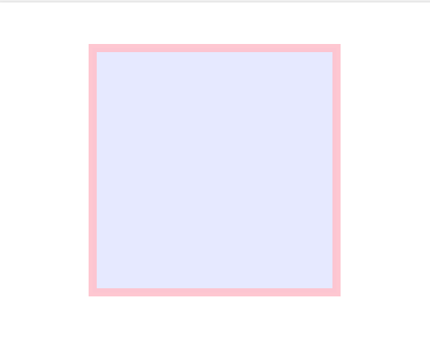

## What are SVGs?
* SVG stands for Scalable Vector Graphic and according to W3schools, it's "used to define vector-based graphics for the web"
* It's defined in XML format
* Every element and attribute can be animated
* Since about 2017 SVGs have been used by all modern web browsers
* One of the main reasons it's so popular is its namesake: scability
* Apart from that, it's also been able to keep up with "current web development demands of...responsiveness, interactivity, programmability, performance, and accessibility"
--- 
**Here are some common SVG shapes:**

1. Rectangle <rect>
2. Circle <circle>
3. Ellipse <ellipse>
4. Line <line>
5. Polyline <polyline>
6. Polygon <polygon>
7. Path <path>

Now, let's look at an example in action for a rectangle:

`<rect x="50" y="20" width="150" height="150"
style="fill:blue;stroke:pink;stroke-width:5;fill-opacity:0.1;stroke-opacity:0.9" />`

Here we can see that it's a square with height and width of 150 pixels, and it's placed on the coordinates (50,20). These coordinates always start from the upperleft corner.

We can also see that it's easy to insert style specifications within the rectangle element. When it's placed in an HTML document as an inline element, it can be manipulated both by CSS and Javascript. This makes it much more flexible than a png or pdf image.

Here's another example, this time a line:

`<svg height="210" width="500">
  <line x1="0" y1="0" x2="200" y2="200" style="stroke:rgb(255,0,0);stroke-width:2" />
</svg>`

As you can see, the line element is nested inside the svg element, which provides the canvas for the line.

So how does SVG respond to scalability and responsiveness?

By using shapes, numbers, and a coordinate grid to render elements, rather than pixels, it's resolution independent and can be infinitely scaled. This is handy when using features like zoom (for example, in a detailed visualization). Even when combining shapes, path, and text elements, the resolution won't pixelate. Now we'll see some examples of how SVGs can be used in data visualizations.

Interactive example: https://www.w3schools.com/graphics/tryit.asp?filename=trysvg_rect2

**References:**
* https://www.sitepoint.com/svg-101-what-is-svg/
* https://www.w3schools.com/graphics/svg_intro.asp
* https://www.w3schools.com/graphics/svg_rect.asp

